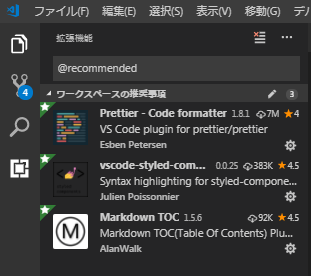

# 開発セットアップ

<!-- prettier-ignore-start -->
<!-- TOC -->

- [開発セットアップ](#開発セットアップ)
- [インストール](#インストール)
    - [Git（ギット）](#gitギット)
        - [Git インストール後の設定](#git-インストール後の設定)
    - [Node.js（ノードジェイエス）](#nodejsノードジェイエス)
    - [Yarn（ヤーン）](#yarnヤーン)
    - [Visual Studio Code (VS Code)（ビジュアル スタジオ コード）](#visual-studio-code-vs-codeビジュアル-スタジオ-コード)
        - [プロジェクト内必須プラグイン](#プロジェクト内必須プラグイン)
    - [Chrome ウェブブラウザ](#chrome-ウェブブラウザ)
- [ツール選定の理由](#ツール選定の理由)
    - [Node.js](#nodejs)
    - [Yarn](#yarn)
    - [VS Code](#vs-code)
    - [Chrome](#chrome)
        - [Chrome の拡張機能について](#chrome-の拡張機能について)

<!-- /TOC -->
<!-- prettier-ignore-end -->

# インストール

## Git（ギット）

構成管理（ファイルのバージョン管理）

- [Git for Windows](https://gitforwindows.org/)
- 最新版を推奨  
  ※ 参考までに、蝦名環境は `2.16.2.windows.1` または `2.19.1.windows.1`

### Git インストール後の設定

以下のコマンドの実行

```bash
# 文字化け対策などを設定します
git config --global core.quotepath false
git config --global core.autocrlf false
git config --global push.default upstream

# 自己証明書サーバへの接続を許可します
git config --global http.sslVerify false

# リモートリポジトリ接続時に毎回パスワードを聞かれないようにします
git config --global credential.helper wincred

# コミット時のユーザ名/メールアドレスを設定します
# Gitlabに登録したメールアドレス/氏名(ユーザ名ではなく、フルネームで)を使用します
git config --global user.email "<メールアドレス>"
git config --global user.name "<氏名>" ←姓と名の間は半角スペース1つ

```

## Node.js（ノードジェイエス）

ローカル開発サーバー起動とビルドに使う

- [Node.js](https://nodejs.org/ja/)
- LTS 版（2019 年 5 月現在 `10.15.3`）を使う。  
  ※ 2019 年 12 月現在`12.13.1 LTS` だが、`package.json`の定義は`>=8.11.1 <12`なので、その範囲内のものを使う。

## Yarn（ヤーン）

パッケージマネージャー

- [Yarn](https://yarnpkg.com/ja/)
- Node.js のバージョンとコンフリクトしない限り、最新版を推奨  
  ※ 参考までに、蝦名環境は `1.15.2`

## Visual Studio Code (VS Code)（ビジュアル スタジオ コード）

IDE

- [Visual Studio Code - Code Editing. Redefined](https://code.visualstudio.com/)
- 最新版（自動アップデートされる）

### プロジェクト内必須プラグイン

VS Code をインストールしたら、プロジェクト内必須プラグインの一式をインストールする。  
定義は [`.vscode/extensions.json`](/.vscode/extensions.json) にある。  
ほかのプラグインは任意なので、好きに追加していい（たとえば UI の日本語化や配色テーマの変更、Git のグラフ表示）。

VS Code 起動時に表示されるポップアップをクリックするか、サイドバー > 拡張機能 > `@recommended` で検索すると、ワークスペースの推奨としてプラグイン一覧が表示される。  
それぞれの「インストール」ボタンでインストールしたら、必要に応じて「再読み込み」で VS Code を再起動し、有効にする。



## Chrome ウェブブラウザ

ウェブブラウザー

- [Chrome ウェブブラウザ](https://www.google.com/chrome/)
- 最新版（自動アップデートされる）

# ツール選定の理由

## Node.js

React（JSX 式）や TypeScript のトランスパイルに必要。  
最新版 (v12) が使えないのは、依存パッケージの中に対応していないものがあるため。  
同じ理由で、古いバージョンも使えない。

CI サーバーの環境もバージョンを合わせる必要がある。

## Yarn

Node.js には npm というパッケージマネージャーが標準で付属するが、オフラインインストール（ASYNET や CI 環境ではパッケージをオンラインから取得できない）を可能にするため、こちらを使う。  
npm より高速（らしい）というのも理由の一つ。

オフラインインストールの設定は [`.yarnrc`](/.yarnrc) に書かれている。

## VS Code

フロントエンド開発でよく使われ、さらに無償のため。

コードフォーマッターやリンター（コード規約のチェッカー）、デバッグ環境は VS Code を対象に設定している。  
Atom や WebStorm, Vim を使いたければ使ってもよいが、コード規約は自己責任で守るようにすること（コマンドは用意してある）。

## Chrome

メインのサポートブラウザーのため。  
Safari (iOS) もサポートブラウザーだが、環境を用意するのが（社内文化的に）面倒だし、Chrome で動くなら HTML5 標準に準拠していて Safari でも大体動くので、開発中は目をつむる。

ところで IE はいまさら使ってよいブラウザーではない（要件外でもある）。

### Chrome の拡張機能について

下記は React + Redux での開発、およびデバッグで推奨/必須レベルの拡張機能です。  
インストールできない場合はプロキシの設定を疑いましょう。(ASYNET 端末の場合 anag じゃないと出来なかった気が。。。)

- [Redux DevTools (必須)](https://chrome.google.com/webstore/detail/redux-devtools/lmhkpmbekcpmknklioeibfkpmmfibljd)
- [React Developer Tools (任意)](https://chrome.google.com/webstore/detail/react-developer-tools/fmkadmapgofadopljbjfkapdkoienihi?hl=ja)
